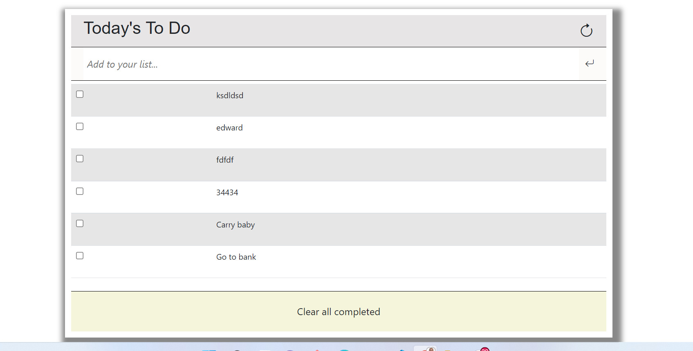

# To-Do-List

This a To-Do List App. In this project, I have added a number of functionality to the application to make it interactive. The user will be able to mark task completion by selecting the corresponding checkbox (or undo it by unchecking the checkbox). The updated tasks list will be stored in local storage. See the screenshot below:

## Built With

- Major languages - `HTML`, `CSS` and `JavaScript`

## Getting Started

Live link: https://white3d.github.io/To-Do-List/

Use this url to clone the repo on your terminal: https://github.com/white3d/To-Do-List.git

After cloning the repo, change dir to the project folder then run the following:
* [x] `npm install`
* [x] `npm start`

Hurray!!! You are now good to go.

## Authors

👤 **Edward Odhiambo**

[Portfolio Website](https://odhiambo-edward.netlify.app/)

- GitHub: [@whit3d](https://github.com/white3d)
- Twitter: [@odhiambo_ed](https://twitter.com/odhiambo_ed)
- LinkedIn: [Edward Odhiambo](https://www.linkedin.com/in/edward-odhiambo-6a462a21b/)

## 🤝 Contributing

To any developer who would wish to contribute to this project, you are welcome!!

## Show your support

Kindly rate ⭐️ this project if you like it.

## Acknowledgments

- Special thanks to Microverse.
